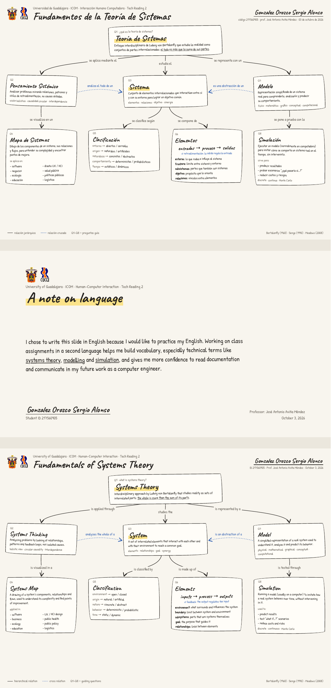

# Writting 1: Fundamentos de la teoría de sistemas

**Materia:** Interfaz Hombre-Computadora · IHC 2026 B  
**Estudiante:** Gonzalez Orozco Sergio Alonso · 217560905  
**Profesor:** José Antonio Aviña Méndez  
**Fecha:** 3 de octubre de 2026

## Propósito y alcance

Esta actividad explica ocho conceptos: teoría de sistemas, pensamiento sistémico, sistema, mapa de sistemas, clasificación, elementos, modelo y simulación. El reporte relaciona estos conceptos con el análisis de una interfaz y añade un ejemplo matemático y pseudocódigo como complemento didáctico.

El material entregado originalmente es un mapa conceptual en español e inglés y una nota personal sobre la práctica del inglés. No incluye un programa en C++, Raylib u OpenGL. Por ello, esta entrega es documental y **no requiere compilación**. El ejemplo complementario no se presenta como una implementación ejecutada.

## Archivos

| Archivo | Contenido |
| --- | --- |
| [reporte.md](reporte.md) | Reporte editable con introducción, desarrollo, modelo, algoritmo, conclusión y referencias. |
| [reporte.pdf](reporte.pdf) | Versión de lectura e impresión del reporte, revisada visualmente. |
| [assets/README.md](assets/README.md) | Procedencia y descripción de la evidencia original. |
| [assets/mapa_conceptual_original.pdf](assets/mapa_conceptual_original.pdf) | Copia íntegra del PDF proporcionado, sin modificaciones. |
| [assets/mapa_conceptual_vista.png](assets/mapa_conceptual_vista.png) | Vista completa del PDF original para consultarlo en GitHub. |

## Cómo revisar

1. Abrir `reporte.md` en GitHub o descargar `reporte.pdf`.
2. Revisar el mapa original en `assets/` y contrastar los ocho conceptos con el desarrollo.
3. Seguir el ejemplo del apartado 3.3: sus resultados se obtienen por sustitución aritmética, sin instalar bibliotecas.
4. Consultar las referencias del reporte. Las ecuaciones del Markdown usan delimitadores LaTeX.

<details>
<summary>Ver el mapa conceptual original</summary>



</details>

## Identificación de la actividad

La carpeta se llama `Writing_01` y el título académico se conserva como **Writting 1**, de acuerdo con la identificación indicada por el estudiante. El PDF fuente muestra **Tech Reading 2** en sus encabezados; se conserva así para mantener el material original. El reporte nuevo corresponde a **Writting 1**.

## Exportar el Markdown a PDF

Ya se incluye `reporte.pdf`. Si se modifica `reporte.md`, debe regenerarse el PDF para que ambas versiones coincidan.

En un editor con exportación de Markdown y soporte de matemáticas, abrir `reporte.md`, activar la vista previa y exportar. Revisar que las fórmulas se vean como ecuaciones y que las tablas no se corten. El PDF incluido usa tamaño carta, márgenes de 2.54 cm y tipografía Times New Roman de 12 puntos; es un formato académico de lectura, no una certificación de cumplimiento íntegro de APA.

Como alternativa, si ya están instalados **Pandoc** y **XeLaTeX**, ejecutar desde esta carpeta:

```bash
pandoc reporte.md --from=markdown+tex_math_dollars --standalone \
  --pdf-engine=xelatex \
  -V lang=es -V papersize=letter -V geometry:margin=1in \
  -V mainfont='Times New Roman' -V fontsize=12pt \
  -V linestretch=1.5 -o reporte.pdf
```

Esta alternativa puede variar la paginación respecto del PDF incluido. Requiere esas herramientas instaladas; no es un paso de compilación de software de la actividad.

## Entrega en Classroom

- [ ] Verificar que la actividad abierta sea **Writting 1**.
- [ ] Abrir el PDF final y comprobar nombre, título, ecuaciones y páginas.
- [ ] Adjuntar `reporte.pdf` y el mapa original si el profesor solicita la evidencia.
- [ ] Agregar el enlace a esta carpeta de GitHub si se solicita.
- [ ] Pulsar **Entregar/Enviar**, confirmar y verificar el estado **Entregado**.
